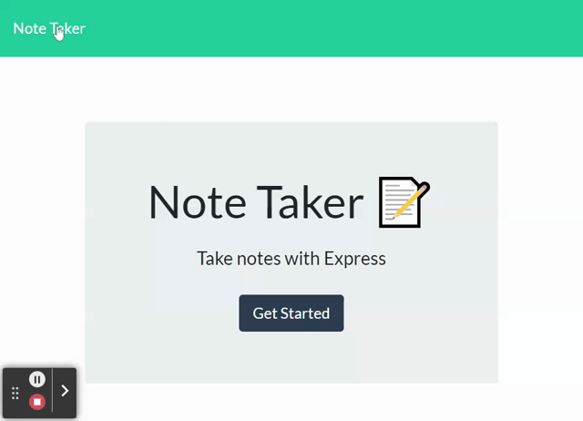

# Note Taker

Note Taker that can be used to write and save notes. This application uses an Express.js back end and save and retrieve note data from a JSON file.

Connect to the application’s front end and the back end, and then deploy the entire application to Heroku.

## Features 

1. write and save notes to organize my thoughts and keep track of tasks I need to complete
2. presented with a landing page with a link to a notes page
3. click on the link to the notes page
4. presented with a page with existing notes listed in the left-hand column, plus empty fields to enter a new note title and the note’s text in the right-hand column
5. enter a new note title and the note’s text
THEN a Save icon appears in the navigation at the top of the page
6. click on the Save icon
THEN the new note I have entered is saved and appears in the left-hand column with the other existing notes
7. click on an existing note in the list in the left-hand column
THEN that note appears in the right-hand column
8. click on the Write icon in the navigation at the top of the page
THEN I am presented with empty fields to enter a new note title and the note’s text in the right-hand column

 ## Portfolio  

* Note Taker 

  
* Heroku : Click 
<a href="https://note-taker-klhi3.herokuapp.com/">Note Taker</a>
 

  
<!-- ## links -->

  
   

:copyright:klhi3

